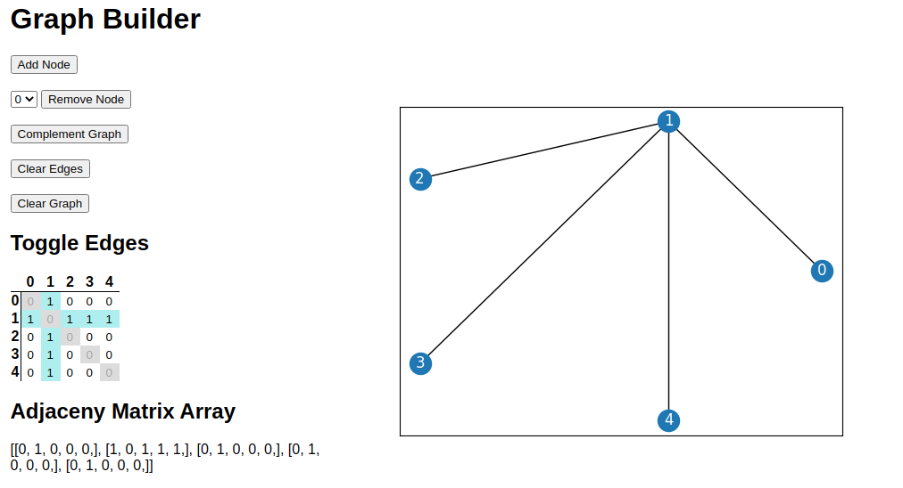

# Graph Builder

This is a Flask webapp that interfaces with a NetworkX graph object.

- Add/remove edges via adjacency matrix interface
- Complement the graph
- Add/remove nodes
- Clear edges/entire graph

## Known Issues
If the wrong graph image appears, refresh the page. I am trying to prevent this with unique file hashes but this is still not entirely resolved. 